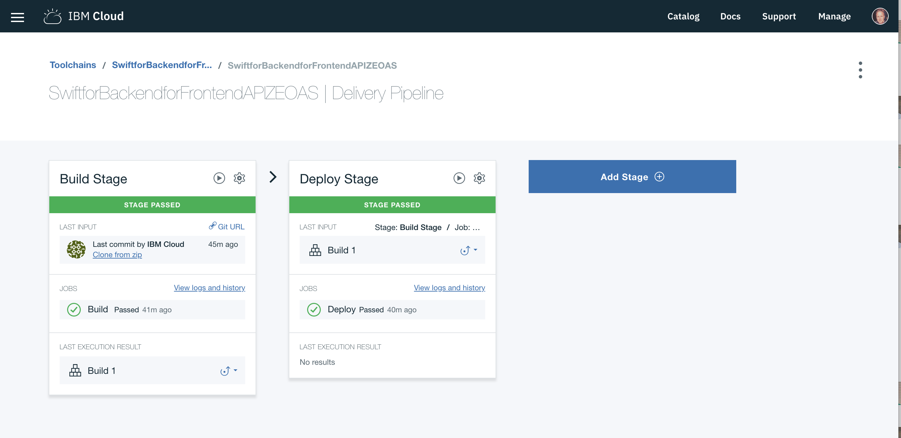

---

copyright:
  years: 2018
lastupdated: "2018-03-15"

---
{:new_window: target="_blank"}
{:shortdesc: .shortdesc}
{:screen: .screen}
{:codeblock: .codeblock}
{:pre: .pre}
{:tip: .tip}

# Leveraging containers with Kubernetes 
{: #containers}

Hit the ground running with {{site.data.keyword.containershort}} by deploying highly available Swift apps in Docker containers that run in Kubernetes clusters. Manage your team development with git, and then use the DevOps Toolchain to manage the deployment of your app to Kubernetes.

Containers are a standard way to package apps and all their dependencies so that you can seamlessly move the apps between environments. Unlike virtual machines, containers do not bundle the operating system. Only the app code, run time, system tools, libraries, and settings are packaged inside containers. Containers are more lightweight, portable, and efficient than virtual machines.

To learn more about {{site.data.keyword.containershort_notm}}, see [Getting started with IBM Cloud Container Service](/docs/containers/container_index.html#container_index).


## Configuring deployments
When you create back-end or web-serving Swift apps you can deploy these into the {{site.data.keyword.containershort_notm}} service which is underpinned with the Kubernetes environment. 

1. Deploy your app to the cloud by setting up an automated cloud pipeline.
2. Click **Deploy to Cloud**.
3. Select Kubernetes as the target. You will need to [create a cluster](https://console.bluemix.net/containers-kubernetes/catalog/cluster/create) if you don't already have one.
4. After your deployment is complete, check out your live app in the cloud by getting the URL in the logs from your deploy stage of the delivery pipeline. The last IP address with a port is your App's new home, for example 169.60.133.124:32355.

## Binding services

As the toolchain is created the services that you associated with your app are bound to the Kubernetes cluster by using Kubernetes secrets. Secrets are used to manage the service credentials outside of your running app. The app reads the secrets and then retrieves the values it needs to starter running. This also enables you to deploy the app to another Kubernetes environment that might be using production level {{site.data.keyword.cloud_notm}} service instances.


If you delete the service or the secrets you will need to manually rebind them or need to delete and recreate the toolchain.
{: tip}

For more information, see [Secrets](https://kubernetes.io/docs/concepts/configuration/secret/).

## Start developing

1. Check out your new online git repository from the toolchain and start working with your code. You can find this by clicking **View Toolchain**.

2. Access the git repository where the code was created by cloning the repo to your MacOS environment. MacOS already comes configured for command line git.

3. Add an Xcode project to your code by running the following command:
```
swift package generate-xcodeproj
```
{: codeblock}

You will then need to open the project within the Xcode IDE.

For more information, see [Developing locally](/docs/swift/developinglocally.html)

## Build and deploy with a toolchain   

 The toolchain contains the build stage and the deploy stage.



### Build stage

The build stage is triggered when a `git push` is run on your git repository. The stage in the pipeline triggers a docker image build and places the image in the container registry.

For more information, see [Getting started with IBM Cloud Container Registry](/docs/services/Registry/index.html#index).

### Deploy stage

The deploy stage retrieves the latest image from the {{site.data.keyword.registryshort_notm}} and then deploy it into your Kubernetes cluster by using a Helm Chart. The Helm chart was added to your app when you deployed to the cloud. Helm charts make it very easy to manage the deployment steps of the packaged container image.

For more information, see [Charts](https://docs.helm.sh/developing_charts/).

{{site.data.keyword.cloud_notm}} now supports a number of [preconfigured Helm Charts](https://console.bluemix.net/containers-kubernetes/solutions/helm-charts).

## Check your app security

The {{site.data.keyword.containershort_notm}} supports the ability to scan the packaged container images for security vulnerabilities. This is essential for supporting enterprise-grade applications.

View the containers [image repository](https://console.bluemix.net/containers-kubernetes/registry/private) to check for potential security vulnerabilities.
