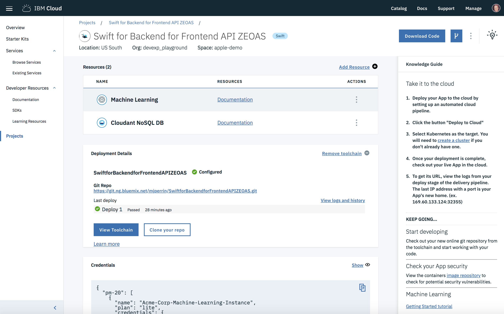
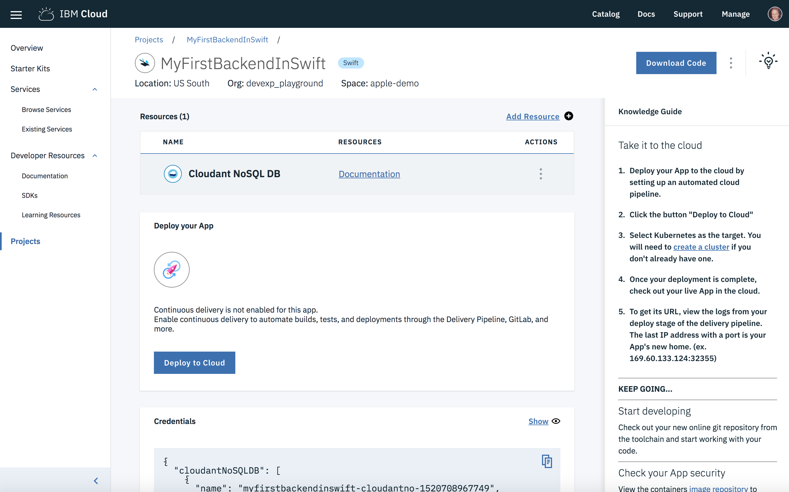
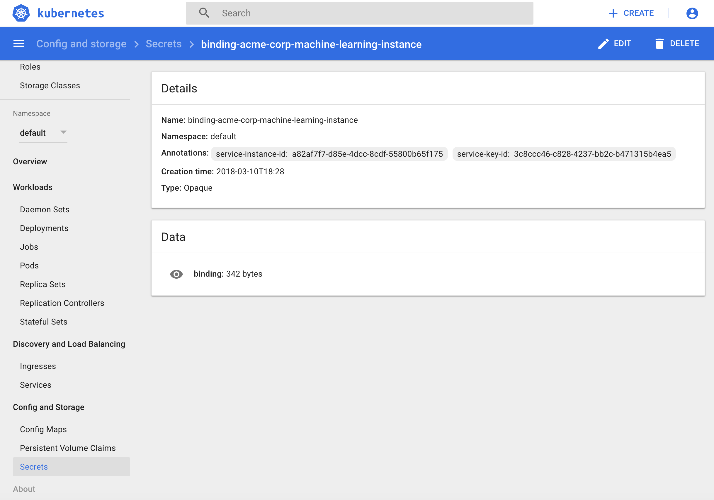

---

copyright:
  years: 2018
lastupdated: "2018-03-15"

---
{:new_window: target="_blank"}
{:shortdesc: .shortdesc}
{:screen: .screen}
{:codeblock: .codeblock}
{:pre: .pre}

# Containers with Kubernetes
{: #containers}

Hit the ground running with IBM® Cloud Container Service by deploying highly available apps in Docker containers that run in Kubernetes clusters.

Containers are a standard way to package apps and all their dependencies so that you can seamlessly move the apps between environments. Unlike virtual machines, containers do not bundle the operating system. Only the app code, run time, system tools, libraries, and settings are packaged inside containers. Containers are more lightweight, portable, and efficient than virtual machines.

[More information](https://console.bluemix.net/docs/containers/container_index.html#container_index)

## Getting Started with Swift
{: ##containers}
When you create Backend or Web serving Swift apps you can deploy these into the IBM Cloud Container service which is underpinned with the Kubernetes environment.

You can achieve this by using the knowledge guide associated with your app in the App details view. The guide can be found on the right hand side and hidden and shown by using the light icon.



### Steps to configure deployments


1. Deploy your App to the cloud by setting up an automated cloud pipeline.
1. Click the button **Deploy to Cloud**
  
1. Select Kubernetes as the target. You will need to [create a cluster](https://console.bluemix.net/containers-kubernetes/catalog/cluster/create) if you don't already have one.
1. Once your deployment is complete, check out your live App in the cloud.
1. To get its URL, view the logs from your deploy stage of the delivery pipeline. The last IP address with a port is your App's new home. (ex. 169.60.133.124:32355)

## Binding services

As the pipeline is created the services that you associated with your app were bound to the kubernetes cluster using the Kubernetes secrets section. Secrets are used to manage the service credentials outside of your running app. The app reads the secrets and then retrieves the values it needs to starter running. This also enables the developer to deploy the app to another kubernetes environment that may be using production level credentials.



Note: if you delete the service or the secrets you will need to manually rebind them or need to delete and recreate the toolchain.

[More information on Kubernetes Secrets](https://kubernetes.io/docs/concepts/configuration/secret/)

## Start developing

Check out your new online git repository from the toolchain and start working with your code. You can find this by selecting **View Toolchain** button.

You can get access to the git repository where the code has been created for you. You can easily clone this code repository to your MacOS environment. MacOS already comes configured for command line git.

You can add an Xcode project to your code by issuing the following command.

```
swift package generate-xcodeproj
```
You will then need to open the create project within the Xcode IDE.

[More information on developing locally](developinglocally.md)

### Toolchain   

 The toolchain contains the build stage and the deploy stage.


** Build Stage **

The build stage is triggered when a `git push` is performed on your git repository. The stage in the pipeline will trigger a docker image build and place the image in the container registry.

[More information](https://console.bluemix.net/docs/services/Registry/index.html#index)

** Deploy Stage **

The deploy stage with tage the versioned image from the Container Registry and then deploy it into your Kubernetes cluster using a Helm Chart. The Helm chart was added to you app on the **Deploy to Cloud** Step. Helm charts make it very easy to manage the deploy steps of deploying the packaged container image.

[More information on Helm Charts](https://docs.helm.sh/developing_charts/)

IBM Cloud now supports a number of pre configured Helm Charts , you can discover these here.

[More information on Helm Charts](https://console.bluemix.net/containers-kubernetes/solutions/helm-charts)

## Check your App security

IBM Cloud container service supports the ability to scan the packaged container images for security vulnerabilities. This is essential for supporting enterprise grade applications.

View the containers [image repository](https://console.bluemix.net/containers-kubernetes/registry/private) to check for potential security vulnerabilities.


## Summary
You should now have a good understanding of how Swift apps can be deployed and managed with the IBM Cloud Container service and how you can manage your team development with git and then use the DevOps Toolchain to manage the deployment of your app to Kubernetes.
