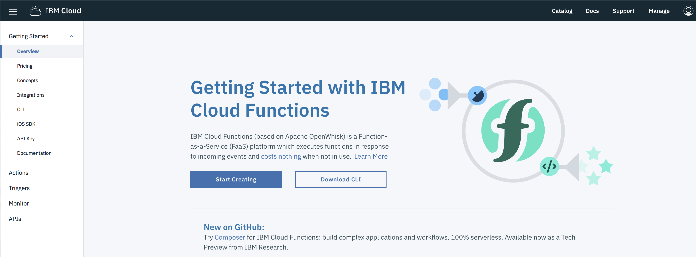
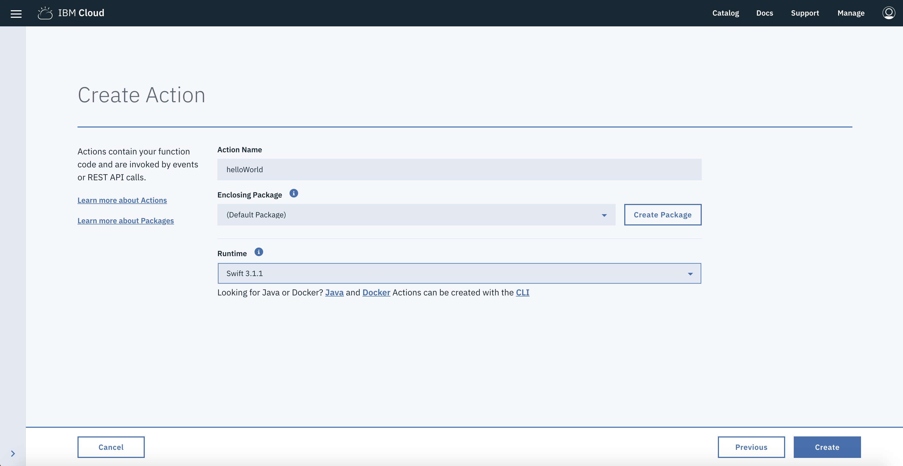
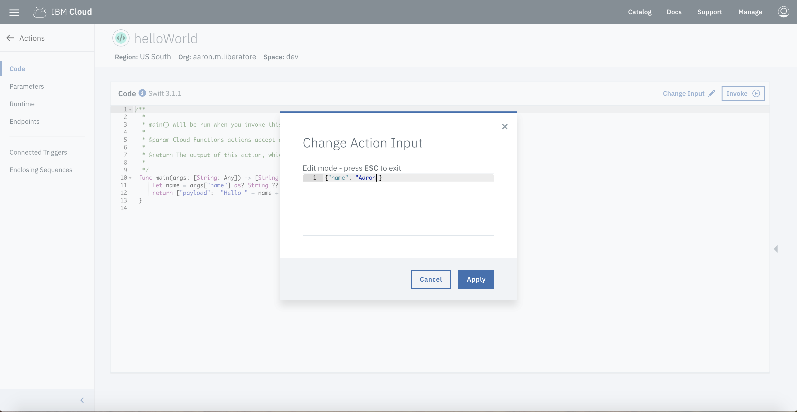
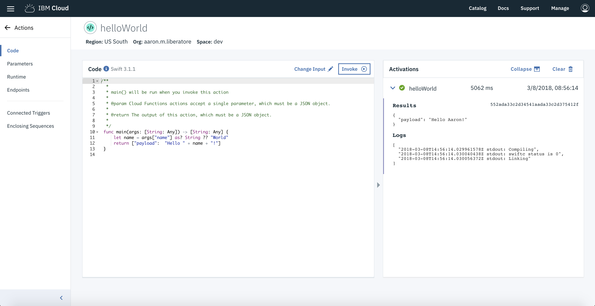
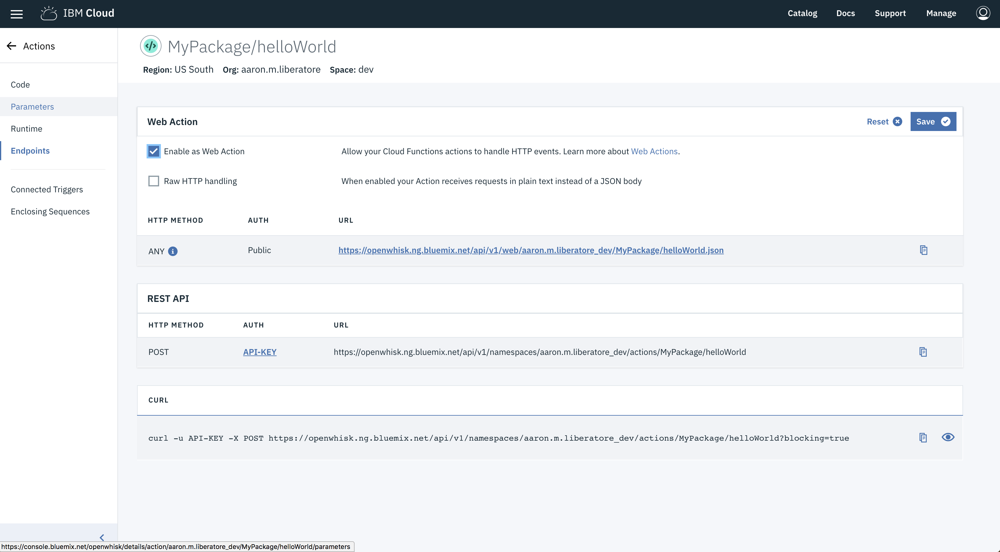

---

copyright:
  years: 2018
lastupdated: "2018-02-15"

---
{:new_window: target="_blank"}
{:shortdesc: .shortdesc}
{:screen: .screen}
{:codeblock: .codeblock}
{:pre: .pre}

# Cloud Functions


To facilitate Serverless development, IBM's Functions as a Service (FaaS) offering, {{site.data.keyword.openwhisk}}, enables application logic to be run in response to events or direct invocations from web or mobile apps over HTTP without provisioning or managing servers.

Since {{site.data.keyword.openwhisk}} performs the system administration including auto-scaling, availability management, and maintenance, developers can focus on writing application logic.

You can use the browser or the CLI to develop your {{site.data.keyword.openwhisk_short}} applications. Both have similar capabilities for developing applications; the CLI provides more control over your deployment and operations.

For additional information on {{site.data.keyword.openwhisk}}, check out our full [documentation](https://console.bluemix.net/docs/openwhisk/index.html#getting-started-with-cloud-functions).

## Develop
{: #openwhisk_start_editor}

### Using the Browser

Try out {{site.data.keyword.openwhisk_short}} in your [Browser](https://console.{DomainName}/openwhisk/actions)! Visit the [learn more](https://console.{DomainName}/openwhisk/learn) page for a quick tour of the {{site.data.keyword.openwhisk_short}} User Interface.

### Using the CLI
{: #openwhisk_start_configure_cli}

To find out more about developing from our {{site.data.keyword.openwhisk_short}} command line interface (CLI), see our [Configure CLI documentation](https://console.{DomainName}/openwhisk/cli) and follow the instructions to install it.

### Hello World Example

To get started with {{site.data.keyword.openwhisk_short}} from the browser head to {{site.data.keyword.openwhisk_short}} from the developer console.

1. Select `start creating`


2. Select `create action` then fill in the form fields. If you would like to namespace your functions as part of a package, feel free to create one and use the drop down to set it.


3. Copy the below code block into the editor.
```Swift
/**
 * Hello world as an IBM Functions action.
 */
 func main(args: [String: Any]) -> [String: Any] {
     let name = args["name"] as? String ?? "World"
     return ["payload":  "Hello " + name + "!"]
 }
```

4. To set the input parameters, select `change input`.


5. Now, simply click `invoke` and you can see the output within the activation sidebar.


For more complex usage examples, including exposing web actions, creating triggers, and building function sequences, checkout some of our [tutorials](https://console.bluemix.net/docs/tutorials/serverless-mobile-backend.html#mobile-application-with-a-serverless-backend) that will walk you through production level serverless mobile development.

### Exposing as Web Actions

By default, {{site.data.keyword.openwhisk_short}} defines actions that require an OpenWhisk authentication key; however, in production mobile environments, it is often necessary to authorize mobile clients based on OAuth flows in order to expose apis and specific data sets.

{{site.data.keyword.openwhisk_short}} allows developers to expose their functions as Web Actions (OpenWhisk Actions), which are annotated, to quickly enable developers to build web-based applications. These annotated Actions allow developers to program backend logic that your web application can access anonymously, without requiring an OpenWhisk authentication key.

To expose an action as a Web Actions, simply navigate to the `endpoints` tab of your action and select `Enable as Web Action`.




Now, users can reach the action from a browser or curl request!

```
$ curl https://openwhisk.ng.bluemix.net/api/v1/web/aaron.m.liberatore_dev/MyPackage/helloWorld.json?name=aaron

{
    message: "Hello aaron!"
}
```

### SDK
OpenWhisk provides a [mobile SDK](https://console.bluemix.net/docs/openwhisk/openwhisk_mobile_sdk.html#mobile-sdk) for iOS and watchOS devices that enables mobile apps to easily fire remote Triggers and invoke remote Actions. A version for Android is not available so Android developers can use the OpenWhisk REST API directly.

## API Reference
{: #openwhisk_start_api notoc}
* [REST API Documentation](./openwhisk_reference.html#openwhisk_ref_restapi)
* [REST API](https://console.{DomainName}/apidocs/98)
* [OpenWhisk Swift SDK](https://console.bluemix.net/docs/openwhisk/openwhisk_mobile_sdk.html#mobile-sdk)
## Related Links
{: #general notoc}
* [Discover: {{site.data.keyword.openwhisk_short}}](http://www.ibm.com/cloud-computing/bluemix/openwhisk/)
* [{{site.data.keyword.openwhisk_short}} on IBM developerWorks](https://developer.ibm.com/openwhisk/)
* [Apache {{site.data.keyword.openwhisk_short}} project website](http://openwhisk.org)
