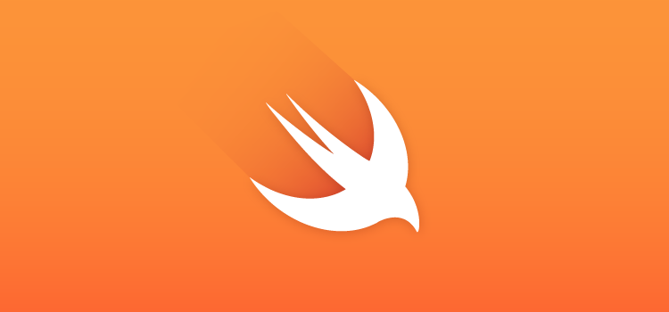

---

copyright:
  years: 2017
lastupdated: "2017-02-19"

---
{:new_window: target="_blank"}
{:shortdesc: .shortdesc}
{:screen: .screen}
{:codeblock: .codeblock}
{:pre: .pre}

# Overview
{: #overview}

 
This programming guide provides an overview of the capabilities that iOS developers can use to learn, experiment, and enhance existing applications.  It is intended to define the architectures, paradigms, and conventions of web and backend programming to a mobile audience while highlighting services created to facilitate mobile development.

This guide will show you how to quickly integrate services into your existing applications, with the exact prerequisites, steps, code snippets, and expected outcomes for each. Additionally, you will find resources for rapid prototyping new applications that utilize these services, such as Starter Kits in the Apple Developer Console as well as Sample Apps. This guide will also discuss how to best develop traditional and mobile-first end-to-end solutions in cloud environments.

With the proliferation of cloud computing, the traditional silos of web and mobile development are becoming increasing less clear. Machine learning capabilities exist on both mobile and server side components, and Swift is robust enough to work in both environments.  Consequently, this guide illustrates how to leverage Swift on the server when building cloud backends, helping to expand the capabilities of iOS developers beyond the traditional Apple ecosystem and into the world of serverless, web servers, and even mainframes.

The powerful capabilities of iOS combined with the innovation of {{site.data.keyword.cloud_notm}} will allow you to create apps with ease, agility, and exciting features like never before.
